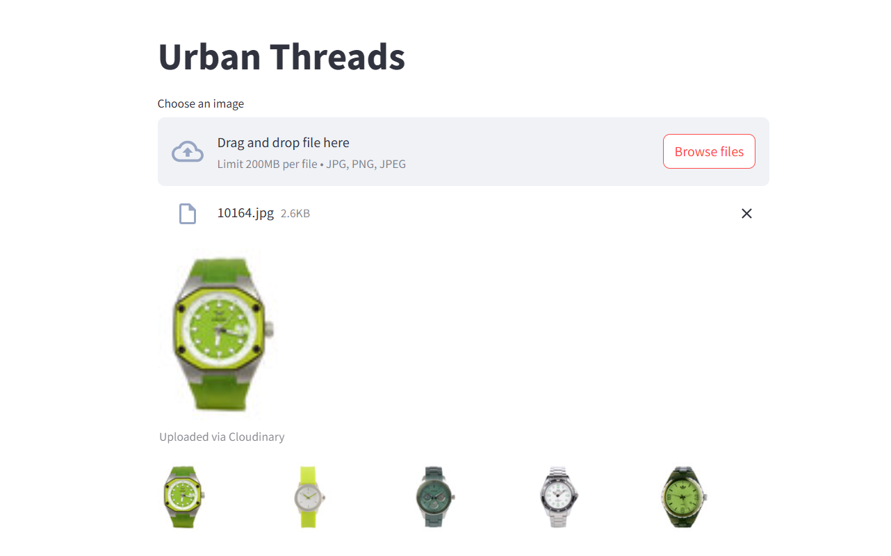

# Urban Threads 👗

A fashion-similarity app using a ResNet-50 model.  
Users upload an image, and the app recommends 5 visually similar items.

---


## 📋 Table of Contents

- [About](#about)
- [Prerequisites](#prerequisites)
- [Setup Instructions](#setup-instructions)
- [Usage](#usage)
- [Dataset & Large Files](#dataset--large-files)
- [Contributing](#contributing)
- [License](#license)

---

## 🧠 About

This project demonstrates an image-based recommendation system built using ResNet-50 features and k-NN similarity.  
**Upload an image → get top 5 most similar images** based on visual features.

Perfect for anyone learning about computer vision, deep learning, and app deployment with Streamlit.

---




## ⚙️ Prerequisites

- Python 3.8+  
- pip (Python package installer)  
- Git  

---

## 🚀 Setup Instructions

1. **Clone the repo:**

   ```bash
   git clone https://github.com/YourUsername/Urban-Threads.git
   cd Urban-Threads

2 . **Create a virtual environment & install dependencies:**

    ```bash
    python -m venv venv
source venv/bin/activate     
pip install -r requirements.txt

3.Prepare your data locally:

Place your image dataset (~44K images) in a folder named images/ in the project root.

Run the script to generate embeddings:

```bash
python app.py
This will create:

embeddings.pkl — feature vectors

filenames.pkl — list of file paths


streamlit run main.py


